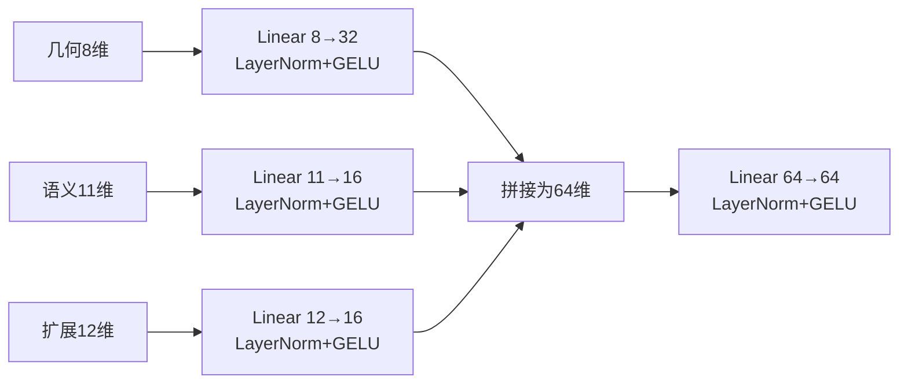

# 04 节点特征与模型结构

## 1. 最终模型使用哪些特征

每个节点有三个显式分支，共31维输入：

```text
几何分支 8维 + 语义分支 11维 + 扩展/频率分支 12维 = 31维
```

它们不是把整座城市压成一个人工统计量，而是先为每个语义对象计算，再由图网络融合。

## 2. 几何分支：8维

| 维度 | 内容 | 直觉 |
|---:|---|---|
| 1 | `log(1+坐标记录数)/10` | 对象几何复杂程度 |
| 2 | 对象质心到模型中心的归一化距离 | 对象在模型中的径向位置 |
| 3—5 | 坐标协方差矩阵3个归一化特征值 | 点集沿三个主方向的形状分布 |
| 6—8 | 节点内部半径的25%、50%、90%分位数 | 局部尺度和形状范围 |

协方差特征值只描述“沿主方向有多分散”，不依赖坐标轴朝向，因此比直接输入XYZ更抗旋转。

## 3. 语义分支：11维

| 维度 | 内容 |
|---:|---|
| 1 | 层级深度，最大按10截断并归一化 |
| 2 | 属性数量的对数归一化 |
| 3 | 是否属于边界表面 |
| 4—11 | 对象类型的8维稳定哈希编码 |

类型哈希不是随机变化的Python哈希，而是SHA-256决定落在哪一维及正负号，因此同样类型每次运行结果一致。

## 4. 扩展/频率分支：12维

| 组 | 维数 | 内容 |
|---|---:|---|
| 复杂度 | 3 | 唯一顶点数、面数、子树对象数 |
| 尺度/形状 | 5 | 三个主轴长度、近似体积、近似表面积 |
| 径向频率 | 4 | 8-bin径向直方图的前4个余弦频率系数 |

这里确实包含体积，也包含能反映顶点数量的唯一点数特征。体积不是精确封闭实体体积，而是由坐标协方差三个特征值乘积构造的尺度稳定近似量。

## 5. 三个分支如何融合



这一步之后，每个节点都变成64维隐藏状态。

## 6. 图传播做什么

最终版本使用一层轻量均值图传播：

1. 每个节点收集所有入边邻居的64维状态；
2. 对邻居状态求平均；
3. 将自身状态和邻居平均信息一起线性变换；
4. 经过GELU、Dropout；
5. 与传播前自身状态做残差相加；
6. 使用LayerNorm稳定数值。

直觉上，一个RoofSurface不再只知道自己的几何，还能获得所属Building及邻近表面的上下文。

### 边类型是否分别独立传递

最终79,857参数模型的传播层是轻量`MeanGraphConv`，不同关系共享传播变换，`edge_type`被保留在张量中但该层不单独学习每种关系的矩阵。

早期R-GCN模型为不同关系学习独立矩阵，关系感知GAT还将关系嵌入注意力。但实验证明它们没有稳定超过轻量均值传播，所以没有作为最终模型。

## 7. 如何从很多节点得到一个图向量

模型使用四种池化：

- **Mean pooling**：所有节点取平均，代表整体常态；
- **Max pooling**：每一维取最大，保留显著局部证据；
- **Attention pooling**：学习哪些节点更重要；
- **Building区域池化**：先按顶层Building聚合，再在建筑之间平均。

另外加入两个8维图级统计：

- 8维语义统计；
- 8维结构统计。

拼接维数为：

```text
64 × 4种池化 + 8维语义 + 8维结构 = 272维
```

然后通过`Linear(272→256) + LayerNorm`得到整个CIM的256维单位向量。

## 8. 256维向量如何变成1024 bit

模型按密钥/seed生成一个`1024 × 256`的固定随机投影矩阵。对图嵌入做矩阵乘法：

```text
1024×256投影矩阵 × 256维图嵌入 = 1024个投影值
```

每个投影值：

- 大于等于0，输出1；
- 小于0，输出0。

得到最终1024-bit内容指纹。投影矩阵默认不是训练参数，所以论文的79,857参数只计算图编码器。

## 9. 参数量和速度

- 可训练参数：79,857；
- checkpoint：约1.32 MiB；
- RTX 4090单图网络前向平均：0.872 ms；
- 峰值显存：约12.2 MiB；
- 实际端到端主要耗时在XML解析和图构建，而不是神经网络。

## 10. 相关代码

- 最终模型：`CIMLiteGeoFuse`，位于`code/cimfusemark/rgcn.py`
- 特征计算：`code/cimfusemark/citygml_graph.py`
- 最终配置：`code/configs/lgfm_robust_binary_all_cim.json`
