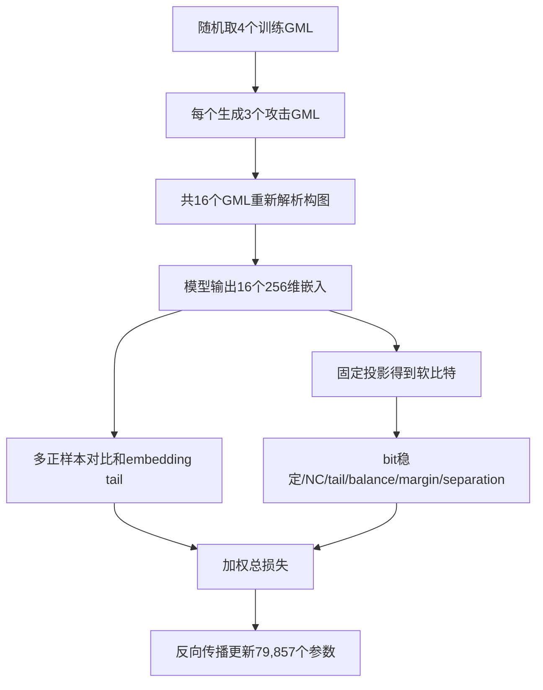

# 05 训练方式与损失函数

## 1. 当前是不是对比学习

是，但不只是“原始特征减去攻击特征”。最终训练是多攻击视图对比学习，并同时直接约束二值指纹稳定性。

每个训练step随机选择4个不同CIM。每个CIM产生：

- 1个干净视图；
- 3个随机攻击视图。

因此一批共有`4 × 4 = 16`个图视图。

## 2. 什么是“视图”

视图不是图片，而是同一个CityGML内容的不同版本。例如：

```text
模型A：原始A、删除40%建筑的A、旋转180°的A、属性删除80%的A
模型B：原始B、坐标噪声的B、空间裁剪的B、语义重标记的B
……
```

攻击直接生成新的`.gml`并重新解析，不是在已经提取好的特征上随便加噪声。

## 3. 对比学习的直觉

对每个视图得到256维嵌入：

- 同一CIM的4个视图是正样本，应彼此靠近；
- 这一批其他CIM的视图是负样本，应彼此远离。

使用多正样本NT-Xent。相比只计算`原始 - 攻击`的均方差，它还利用了不同CIM之间的相对关系。

## 4. 为什么还要直接训练bit

最终判断使用1024-bit指纹，而不是256维浮点向量。两个嵌入即使很接近，只要某些投影值位于0附近，轻微扰动就可能让二值结果翻转。

训练时先使用可导的软比特：

```text
soft_bit = tanh(投影值 / 温度)
```

它接近`-1/+1`，但仍可以反向传播。推理时才用硬阈值得到`0/1`。

## 5. 最终损失由什么组成

### 5.1 多正样本对比损失

让同一CIM的干净/攻击嵌入靠近，让不同CIM分开。

### 5.2 软比特稳定损失

计算干净视图软比特和攻击视图软比特的均方差。它对应用户最直观理解的“原始与攻击结果差值”，但比较的是软二值码，而不只是原始节点特征。

### 5.3 NC对应损失

对接近`-1/+1`的软比特，`(1-clean×attack)/2`近似bit错误率，因此可以直接优化平均NC。

包含两项：

- 所有攻击视图平均NC损失；
- 每个模型最差攻击视图的NC损失。

### 5.4 tail损失

平均值可能掩盖困难攻击。tail损失专门挑最差约34%的视图：

- embedding tail：惩罚最差视图的余弦距离；
- bit tail：惩罚最差视图的软比特差异。

### 5.5 bit balance

防止所有模型大量输出同一个bit，例如每一位几乎全是1。理想情况下，每个bit在一批数据中正负较均衡。

### 5.6 quantization

推动软比特靠近`-1/+1`，避免长期停在0附近。

### 5.7 bit margin

让投影值远离0这个二值决策边界，减少轻微攻击引起的bit翻转。

### 5.8 异源分离损失

计算不同CIM干净软指纹之间的相关性，惩罚过高的正相关，主要改善唯一性。

这个损失可能稍微降低同源攻击NC，因为鲁棒性和唯一性存在竞争。消融实验中去掉它，同源NC反而略升，但异源区分会变差。

## 6. 最终配置

关键配置文件：`code/configs/lgfm_robust_binary_all_cim.json`

| 参数 | 值 |
|---|---:|
| 训练轮数 | 2,400 |
| 每批CIM数量 | 4 |
| 每个CIM攻击视图 | 3 |
| 图嵌入维数 | 256 |
| 指纹位数 | 1024 |
| 学习率 | 0.001 |
| 优化器 | AdamW |
| weight decay | 0.0001 |
| 对比温度 | 0.1 |
| bit温度 | 0.1 |
| tail比例 | 0.34 |

## 7. 12类训练攻击

训练覆盖：

1. 混合对象删除；
2. 整栋建筑删除；
3. 语义表面删除；
4. 属性删除；
5. 坐标噪声；
6. 坐标量化；
7. Z轴旋转；
8. 顺序组合攻击；
9. 连续空间裁剪；
10. 层级扁平化；
11. 语义重标记；
12. 建筑添加。

最终训练直接覆盖强度端点，包括80%结构删除。这是为了获得完整强度曲线；80%仍应解释为压力测试，不代表剩余20%内容在语义上一定等同原模型。

## 8. 一次训练step的数据流



## 9. 三随机种子的意义

最终模型用2026、2027、2028三个seed独立训练。结果不是把同一模型评估三次，而是重新初始化、重新采样攻击并重新训练。三种子核心攻击平均NC为：

- 2026：0.9039；
- 2027：0.9196；
- 2028：0.9130；
- 均值±标准差：0.9122±0.0079。

说明鲁棒性结果不是单次幸运初始化造成的。

## 10. 相关代码

- 训练入口：`code/train_robust_contrastive.py`
- 损失函数：`code/cimfusemark/robust_losses.py`
- 攻击实现：`code/cimfusemark/xml_attacks.py`
- 最终配置：`code/configs/lgfm_robust_binary_all_cim.json`
