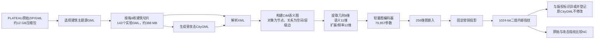

# CIMFuseMark 中文研读手册

这套文档面向第一次接触图神经网络、CityGML 和零水印的读者。阅读时不要求预先理解深度学习公式；遇到术语可以先看直觉解释，再回头看技术细节。

## 推荐阅读顺序

1. [01-项目要解决什么问题.md](01-项目要解决什么问题.md)：理解研究动机、输入和输出。
2. [02-数据集与文件说明.md](02-数据集与文件说明.md)：弄清用了哪些城市、文件在哪里、为什么约14 GB。
3. [03-CityGML如何变成图.md](03-CityGML如何变成图.md)：理解节点、边以及图构建。
4. [04-节点特征与模型结构.md](04-节点特征与模型结构.md)：理解31维节点信息、图编码器和1024-bit指纹。
5. [05-训练方式与损失函数.md](05-训练方式与损失函数.md)：理解对比学习、攻击视图和各项损失。
6. [06-零水印登记认证与Hybrid10.md](06-零水印登记认证与Hybrid10.md)：理解为什么它叫零水印，以及个性化投影的作用。
7. [07-攻击实验与评价指标.md](07-攻击实验与评价指标.md)：理解攻击强度—平均NC曲线和唯一性。
8. [08-代码目录与复现路线.md](08-代码目录与复现路线.md)：把算法概念映射到代码文件。
9. [09-常见问题与论文结论边界.md](09-常见问题与论文结论边界.md)：集中回答容易混淆的问题。

## 一张图看完整数据流

## 先记住五句话

1. **输入是原生 CityGML，不是截图、点云或普通三角网格。**
2. **一个图节点是一个CIM语义对象**，例如一栋Building或一个WallSurface。
3. **模型不把水印写进文件**，而是从内容中提取稳定的1024-bit指纹，所以叫零水印。
4. **训练时让同一CIM的原始版本和受攻击版本靠近，让不同CIM尽量分开。**
5. **论文同时看鲁棒性和唯一性**：同一个模型受攻击后NC要高，不同模型之间NC要低。

## 当前最终版本

| 项目 | 当前设置 |
|---|---:|
| 数据 | 日本Project PLATEAU，10个地区 |
| 实验瓦片 | 143个，每个通常8栋建筑 |
| 建筑总数 | 1,137栋 |
| 图节点总数 | 33,688 |
| 图边总数 | 166,166 |
| 指纹 | 1024 bit |
| 图嵌入 | 256维 |
| 可训练参数 | 79,857 |
| 训练攻击 | 12类 |
| 最终Base三种子核心攻击NC | 0.9122 ± 0.0079 |
| Hybrid-10测试核心攻击NC | 0.8965 |
| Hybrid-10测试异源平均NC | 0.6177 |

> 本手册描述的是论文当前锁定版本。早期的R-GCN、GAT、频域增强和部分编码器微调仍保留在代码中作为探索与消融，不等于最终主模型。
